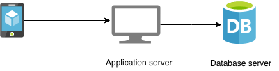
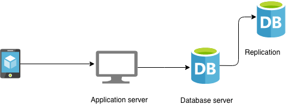
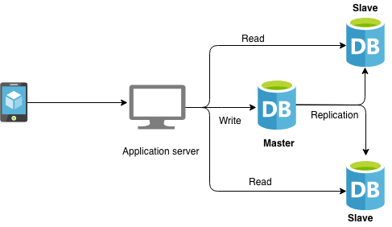
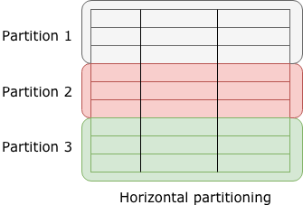
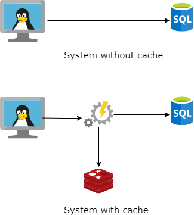

Chào mọi người mình đi phỏng vấn căng thẳng, 3 nhân vật chính sau đây:

    - 👨‍🦳: Bác Senior Solution
    - 👳‍♂️: Anh Senior Engineer
    - 👨‍🔧: Mình Dev đua đòi thích đủ thứ.

## Databases

### Phần 1

👨‍🦳: Anh cho chú cái DB này chú phân tích xem?

👨‍🔧: Ok anh, có 3 thứ chúng ta cần phải đề cập ở đây:

- Thứ 1 cái DB của anh mà ngỏm tắt điện cả hệ thống rồi.
- Thứ 2 cái Server App của anh mà nó crashed thì cũng tắt điện.
- Thứ 3 theo lý thuyết anh có cái DB mà ko biết cái máy chứa nó I/O best cỡ nào mà cứ đè ra đọc ghi lia lịa. DB là một cô nàng xinh đẹp mà anh cứ i/o lia lịa thì em nó tắt thở mất thôi. Trước hết chúng ta phải thêm 1 DB nữa để backup.

> Chúng ta sẽ dùng `master-slave pattern` để giải quyết vấn đề này

Với cách này chúng ta sẽ đạt đc 3 tiêu chí `system availability, protection against data loss, and performance gain`.

> Ok! để cải thiện khi hệ thống scale lên đột thì `Separate of concern` là một ý tưởng ko tồi. Để một cái master làm WRITE rồi cho 2 con slave để READ

👨‍🦳: Vậy lỡ con Master tạch luôn thì sao?

👨‍🔧: Mà để chắc ăn trong trường hợp wrong Query, file system isse ở production thì nên có 2 con master chạy song song và các hệ thống vệ tinh slave chạy cheo nó. `Backup of backup`.

Thì khuyết điểm của trò này: là dữ liệu nó sẽ có một độ trễ nhất định khi gặp sự cố. Nhưng đảm bảo được tính liên tục và bảo toàn. Giống như Linkekin đôi khi ghi vẹo vào rồi, mà F5 nó ko lên cái update. Kiểu vậy, nhưng ở nhưng bài toán chấp nhận lag kiểu này vẫn ok.

👨‍🦳: ... Bác hỏi hỏi ...?

👳‍♂️: ... làm sao code cái này, làm sao code cái kia, khi xài Nodejs xài thư viện gì.... 🥶

👨‍🔧: ... mình bí khá nhiều 😂

### Phần 2

👨‍🦳: Bây giờ giả sử một table có 10k nhân viên, hay 10k người mua hàng và mỗi row có nhiều columns, thế theo chú thì điều này có vấn đề gì không?

👨‍🔧: ...một table mà nhiều row thì giống như một cái từ điển có nhiều trang tùm lum tè le vậy, trước hết để giải quyết vấn đề tìm hiệu quả thì phải `index`. Trong ngày đẹp trời doanh nghiệp yêu cầu user cập nhật CMND để lấy Voucher trong vòng một ngày chẳng hạn điều này làm hệ thống sẽ quá tải khi xử lý 10k người. Để ghi được vào 1 row. Trước hết là tìm và sau đó là ghi. `TÌM`, `GHI`. Một table mà nhiều column thì mỗi lần tìm Operation này sẽ pull 1 đống dữ liệu không cần thiết. Nó làm hao phí `CPU, IO, NETWORK`. Trước hết là phải làm sao cắt cái table đó ra cho hiệu quả trước.

    > Horizontal partitioning

- Nhìn vô bản chất `Employee` hay `Customer` thì tạm chia đại theo Vùng `Employee.country` as `China`, `Vietnam`... Khi chia nhỏ ra để trị thì size bài toán đã nhỏ hơn. Bây giờ sẽ đẩy về từng cluster để chia nhỏ bài toán I/O.
- Tổng số I/O 1 chỗ bằng M thì khi chia ra M/n. Chiến thuật chia càng hiệu quả thì càng đỡ chi phí.

    > Vertical partitioning

- Do table có nhiều column và có những column hay thay đổi, và có nhiều column rất ít thay đổi với chiến thuật này thì chia ra 2 bảng dành cho `Employee[id,org,salary]`, `Employee[id,picture]`, `Employee[id,name,email]`

  > Partitioning improves your database availability and performance.

👨‍🦳: Thế cậu có biết gì về sharding ko?

👨‍🔧: ...lục lọi trong ký ức, dkm mình dạo này code frontend nhiều quá lú rồi. Em không nhớ mà theo lý thuyết `sharding` nó là bản nâng cấp của `horizontal partitioning`. Sharding sẽ store dữ liệu ở nơi vẹo nào cũng đc, không nhất thiết phải cũng `server`. Nó chia data ra nhiều server khác nhau và tạo ra nhiều `overhead` hơn.

> Algorithmic sharding, Dynamic sharding

👨‍🔧: Em cũng không rành cái này lắm 😂

## Performnace 
### Phần 3

👨‍🦳: Ok, no worry! (bác cúi xuống ghi ghi cái gì đó). Ok! i'm done. Ravik please!

👳‍♂️: Ok, Khan i have question for you 🗣. Bạn có xài caching framework gì không?

👨‍🔧: Caching? Framework? 🙄🙄😶😶😶😑

👨‍🔧: Ok, trước hết chúng ta sẽ nói tại sao caching. Thì tạm chia làm 2 loại không gian và thời gian. Các yếu tố ảnh hưởng đến thời gian có thể hiểu là `Tốc độ IO, Tốc độ xử lý thuật toán, Tốc độ mạng, Tốc độ encrypt, tốc độ decrypt ..`

👨‍🔧: Nói chung tạm gọi T là tổng hợp các operations có thể ảnh hưởng đến biến số thời gian để từ khi yêu cầu và xử lý được chấp thuận. Nếu một hệ thống mà không có cache về mặt cơ bản là ăn `shit`. Mà cache ở đâu thì lại tùy. Thường thì em dùm `Redis` và cache trên `RAM`. Em cũng muốn cache trên `CPU,L1,L2` mà méo biết làm. Túm lại cache trên `RAM` vì `IO` của `RAM` nhanh hơn `IO` của `Disk`. Còn trade-off là solution này ngốn `RAM`.

👳‍♂️: Vậy bạn xài Redis à, bạn có thể nói tôi là bạn khai báo như thế nào trong Nodejs ko?

👨‍🔧: (Lúc này hơi hoảng) 🤕 móa chả nhớ. Em mới xài nó với PHP chưa code nodejs bao giờ

👳‍♂️: Bạn nói 3 năm kinh nghiệm Nodejs mà chưa xài Redis với Node bao giờ à? 🤬

👨‍🔧: ...😫

👨‍🦳: Ok, no worry! Thế bên PHP mày xài cái gì cũng Redis à?

👨‍🔧: Đúng rồi anh, cũng redis mà em xài Framwork, nó đc config sẵn.

👨‍🦳: Ok! vậy nó xài thế nào?

👨‍🔧: Vắt não, thực sự PHP cũng méo nhớ làm sao lại lôi lý thuyết ra chém tiếp

👨‍🔧: Nói về `caching` thì chủ yếu là bàn về `stragegy` thường là ở phía `backend` toàn là mấy cục data và chi phí ghi i/o trên disk nó cao hơn. Nên những thứ cần tối ưu I/O thay vì nhào vô server lụm lụm lụm. Thì cache bố đâu đó gần nhà gọi cho lẹ. Ý em nói gần nhà là `CDN`

👨‍🦳: Khoan mày nói là `strategy` ý mày là sao, mày xài strategy gì rồi?

👨‍🔧: Chém cái vẹo gì cũng không nhớ nữa ...

> First in first out, Least recently used, Least frequently used

👨‍🔧: Trong các chiến thuật về cache thì `caching level`. Như mấy cái `HTML` kiểu `Skeleton` ít thay đổi, hay mấy cái JSON config em cache bố nó ở client cho lẹ. Còn mấy cái static thì dùng `cdn` cho gần nhà user giảm tải thời gian package traveling. Với mấy cái web nặng nhất là cái hình. Để gần nhà user là win 80%. Còn PHP dự án trước em làm đa số là cache ở Server cái dự án do nó đưa logic về phía DB xử lý nhiều và chi phí tốn nên PHP có có sẵn cơ chế cache cái file đó. Em cũng không đi sâu vào.

> client cache, cdn cache, server cache. 

👳‍♂️: Gì cache ở phía `Server` à, vậy mốt muốn `scale` lên `3,4 node` thì sao?

👨‍🔧: Vâng cái này, nó bị issue là `server` nó `statefull` mịa nó rồi, scale lên 3,4 node chắc ăn shit quá? Mà thực ra nếu con `load balancer` nó tự điều hướng theo user request có điều kiện thì cũng ổn. Còn chơi `RoundRobin` thì chắc cache nó bị  `cache miss problems`. 

👳‍♂️: Thế sao không đặt một con Node làm Cache chung cho hết?

👨‍🔧: Vâng cái này, cũng vã lắm tụi em chạy feature thấy mẹ time đâu mà tái cấu trúc lại. Với đặt một con cache chung thì lại lòi ra `Single point of Dead` con cache có thể bị `bottleneck` bị `die`. 

👳‍♂️: ... 😣

👨‍🔧: cách tiếp cận về caching thì có 3 kiểu: 
- Cache-aside pattern: https://codeahoy.com/2017/08/11/caching-strategies-and-how-to-choose-the-right-one/

- read-through pattern:

- write-through pattern:

👨‍🔧: với caching ta sẽ improve được application perfomance, giảm thiểu chi phí I/O ở database, giảm i/O ở backend application, 

👳‍♂️: ...

👨‍🦳: ....

### Phần 4: Consistent Hashing
### Phần 5: Thiết kế một ứng dụng 